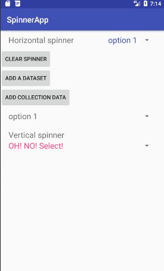

# EasySpinner

Styling and manipulating data in android spinner is hard. Make it easy.

## Demo

## Spinner types

- [Horizontal Spinner](#horizontalspinner)
- [Vertical Spinner](#verticalspinner)
- [Normal Spinner](#normalspinner)

## License

MIT
